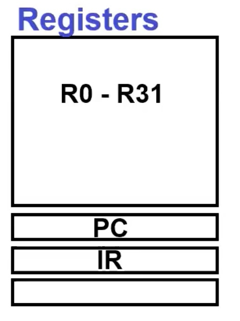
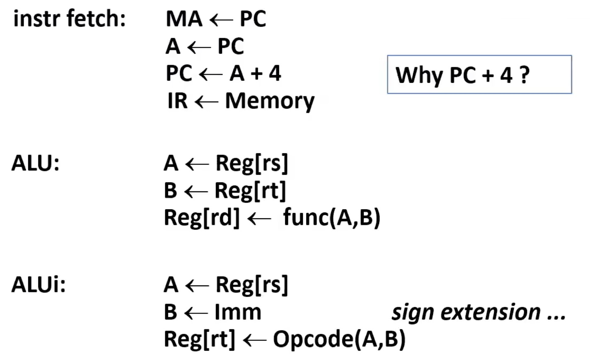
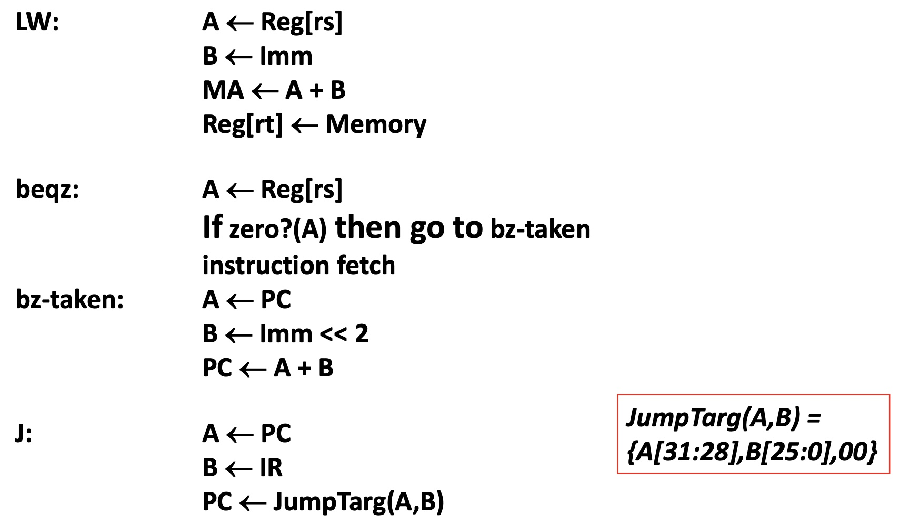

# Lesson4 MIPS Micro-Architecture

[TOC]

## Objectives &  Prior Learning

* Analyze characteristics of pipelines
* Explore a typical RISC / MIPS
* Explore data formats and memory addresses
* Demonstrate understanding of control signals
* Analyze steps of MIPS datapaths


Patterson, Chapter 3 and Appendix C
* Amdahl’s Law
* Cycles per instruction
* Pipelining basics

---

❓In reference to the problem of solving four operations of the equation below:

```
Z=F(x,y)=sqrt(x^2+y^2)
```

What possible problems, related to the input variables, may be caused in the parallel processing implementation? Will the same problems also show up in a non-pipelined implementation? What are the differences?

🤔~~Both variable x and y need to be squared, so if there is only one hardware for square, then one variable will wait for the other one to complete the square operation. But for non-pipelined implementation, these problems won't happen, since the operations are executed one by one, sequentially.~~

👨‍🏫Actually, the question should be "pipelined processing implementation", not parallel. One issue would be that x and y don't have the same precision, for example, x is single precision  and y is double precision. In that case, we should use different kinds of square hardware. Another problem is the overflow and underflow. That's a general problem and it also can happen in a non-pipeliend implementation.

ℹ️Assembly line: a manufacturing process, simialr to pipeline.

👨‍🏫How to handle overflow and underflow? One student said may be we use another flag bit, but the professor said a more common way in practice is to do nothing and let it go. Hardware will try their best to give a result, for example, a float number may be converted into a double one for calculation. After finishing the calculation, it will be converted back to a float number. If a overflow happen, then it will output the maximum number it can represent... Many different mechanisms, depanding on the designer, there always be some trade-off.

👨‍🏫Finally, for the differences, the pipeliend version have to handle with the rest of instructions, either flush them or store them in somewhere. But for unpipelined version, no extra efforts need to be done.

---

❓What are the differences between relative and direct/absolute addressing modes and which one is preferred in processors and why?

🤔Relative one means the address should be calculated based on a baseline and we will add some offsets to it. Direct or absolute addressing means the actuall address has already been given so we don't need to calculate it anymore. I think the latter one is preferred in processors since they don't need a *adder* hardware for address calculation.

👨‍🏫Although my answer make sense in some degree, but in reality, relative addressing is preferred, especially for RISC architecture. Reasons:
1. makes programs locatable (when loading a program into a system, you don't have to put in a specific location of memory)
2. the number of bits to represent the location for relative addressing is much less than the direct addressing

听了老师的回答，感觉自己太naive，思考不够全面...


## Instruction pipelines


* Execute billions of instructions, so **throughput** is what matters
* What is desirable in instruction sets for pipelining?
  * Variable length instructions vs. all instructions same length?
  * Memory operands part of any operation vs. memory operands only in loads or stores?
  * Register operand in various places in instruction format vs. registers located in same place?
* Conclusion: **RISC** is easier to pipeline.


## MIPS 

### A "Typical" RISC

* 32-bit fixed length instruction (3 formats)
* Memory access only via load/store instructions
* 32 32-bit GPR (RO contains zero)
* 32 32-bit FPR — 16 64-bit double-precision
  * DP uses a pair 
* 3-address, reg-reg arithmetic instruction; registers in same place in instruction format
* Single address mode for load/store: base + displacement
* Simple branch conditions; addressing modes: PC relative and register indirect
* Delayed branch
* Some versions of SPARC, MIPS, HP PA-Risc, DEC Alpha, IBM PowerPC, DSP processors

### Data Formats and Memory Addresses

* Data formats
  * Bytes, half words, words and double words
* Byte addressing
  * Most significant Byte VS Least significant Byte
  * Big Endian VS Little Endian
* Word alignment
  * Byte addressable memory
  * A word address can begin only att 0,4,8...


❓MIPS 的 Endian type？

🤔~~盲猜一个Big Endian，因为感觉用Little Endian的比较少。~~

🌐Professor skip this question so I search online. The answer is little-endian. Check this [link](https://stackoverflow.com/questions/46533430/is-mars-mips-simulator-big-or-little-endian) for more information. 

### instruction set architecture

Instruction Categories
* Load/Store
* Computational (Fixed-point etc)
* Floating-Point
* Jump and Branch
* Special







### Instruction Execution

1. instruction fetch

2. decode and register fetch

3. ALU operation

4. memory operation (optional)

5. write back to register file (optional)

### Control Signals



❓Why PC + 4?

🤔A instruction is of 32 bits. 32 bits is equal to 4 bytes. Since the memory is byte addressable, so we use PC + 4 to access the next instruction.



Alternative: Microinstructions

## Micro-architecture

###  Microarchitecture: Bus based Data Path (Implementation of an ISA)




(53:45 lec4 live) More explanation on this graph. Since each time the bus can load at most one data, buffer is needed.


Accroding to the previous image, we can know that:


---

❓Can a Jump (JP) instruction in a MIPS processor-based computer transfer the control to any instruction in the system memory space or not and why?

🤔~~I think no. JP instruction only can jump to the user's codes.~~

👨‍🏫(1:07:13) JP instruction has 28 bits for address? You can only jump to the same page? I don't hear really clearly so it may be not the case... The question and the next question is for understanding the execution of jump and branch instruction. Here is what I found online:

🌐

> The `J` and `JAL` instructions use 6 of the 32 bits to specify the opcode. This leaves 26 bits to specify the target address. The target address isn't specified directly in the instruction though (there aren't enough bits for that) - instead, what happens is this:
> *   The low 28 bits of the target address are shifted right 2 bits, and then the 26 least significant bits are stored in the instruction word. Since all instructions must be word-aligned the two bits that we shifted out will always be zeroes, so we don't lose any information that we can't recreate.
> *   When the jump occurs, those 26 bits are shifted left 2 bits to get the original 28 bits, and then they are combined with the 4 most significant bits of the address of the instruction following the `J`/`JAL` to form a 32-bit address.
> 
> This makes it possible to jump to any instruction in the same 256MB-range (2^28) that the jump instruction is located in (or if delayed branching is enabled; to any instruction in the same 256MB-range as the instruction in the delay slot).

---

❓What about a Branch (BR...) instruction?

🤔My answer is the same.

🌐
> For the branch instructions there are 16 bits available to specify the target address. These are stored as signed offsets **relative to the instruction following the branch instruction** (again with two bits of shifting applied, because it's unnecessary to store something that we know will always be 0). So the actual offset after restoring the 2 least significant bits is 18 bits, which then is sign-extended to 32 bits and added to the address of the instruction following the branch instruction. This makes is possible to branch to +/-128kB within the branch instruction.

> If you want to jump to some arbitrary address, load the address into a register and use the `jr` or `jalr` instruction to jump.

Reference: [MIPS jump and branch instructions range - Stack Overflow](https://stackoverflow.com/questions/36442586/mips-jump-and-branch-instructions-range) There is an example in this answer which can help you understand better.

---

❓Can the design on page 15 be pipelined? Why or why not?

🤔~~Yes. Just divide it into several stages and make sure each stage doesn't have hardware conflict.~~

👨‍🏫No, since we have only one bus for data communication between different stages and the limited of this bus, we can't pipeline the instructions. 