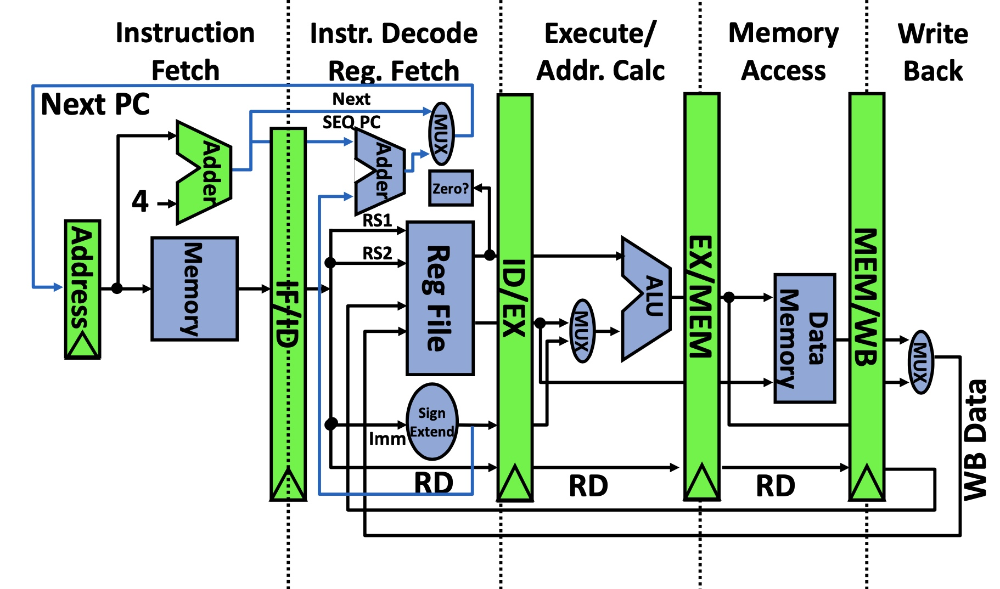
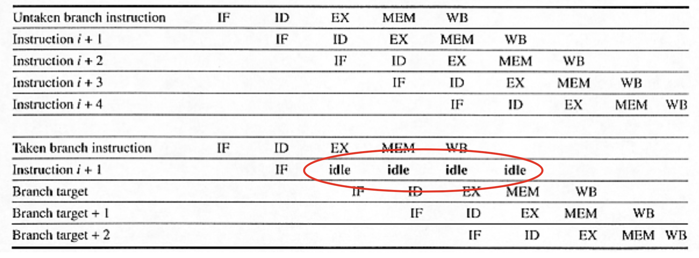
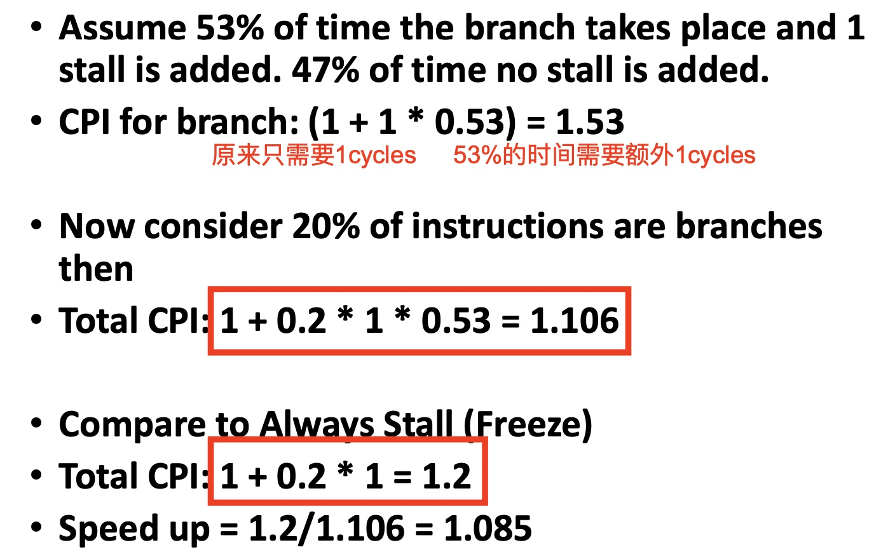
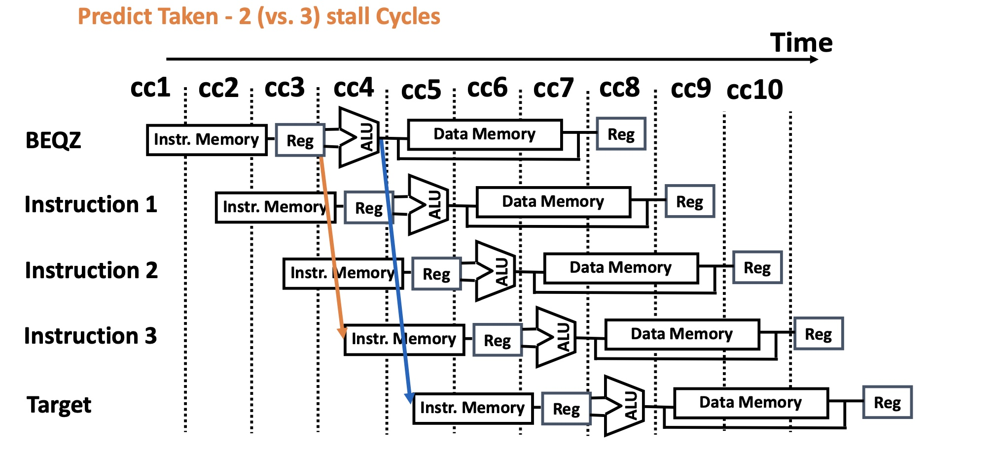
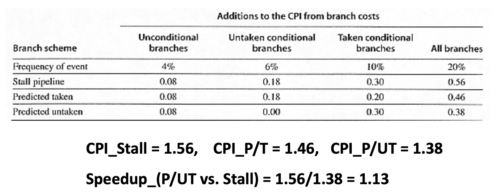
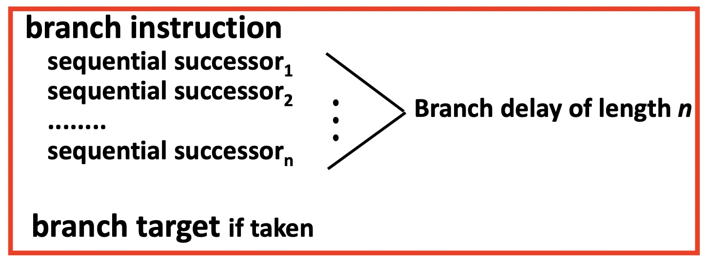
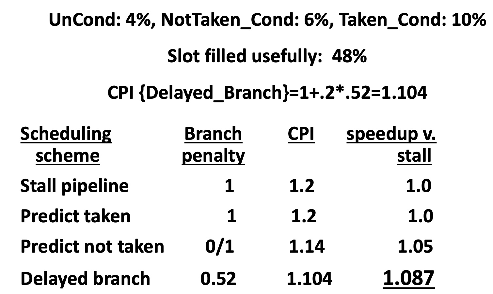
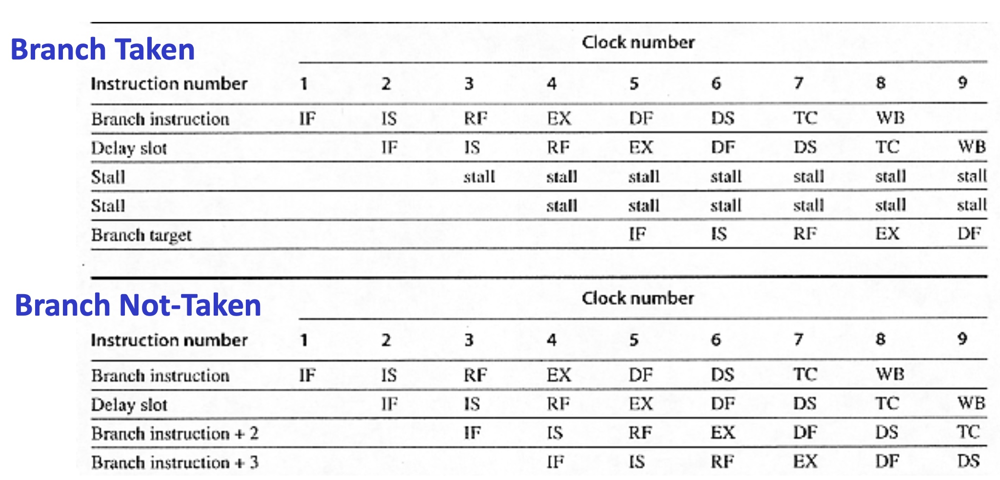

# Lesson 8 Dealing with Branches in MIPS

[TOC]

## Objectives &  Prior Learning
* Explore characteristics of static and dynamic branch prediction
* Compare seven branch prediction / handling schemes
* Identify drawbacks related to branch prediction / handling schemes

Patterson, Chapter 3 and Appendix C 
* Software scheduling to avoid hazards
* Multi-cycle operations, pipeline, and hazards
* Static scheduling in multi-cycle
* Control hazards
* Stalls in pipeline

---

❓What can the high level program do to reduce the stalls due to branches?

🤔Re-arrange the order of branches, always put the branches with high probablity as the first branch.

👨‍🏫Reduce branches and jumps.

## Dealing with Branch in MIPS

* Branch penalty is significant
* Two part solution:
  * Determine branch taken or not sooner
  * Compute taken branch address earlier 
* MIPS branch tests if register = 0 or ≠ 0
* MIPS solution:
  * Move Zero test to ID/RF stage
  * Adder to calculate new PC in ID/RF stage
  * 1 clock cycle penalty for branch versus 2

Here is the modified version of MIPS pipeline (compared with the old one in slide 7):




## Four Branch Hazard Alternatives

### Stall until branch direction is known 

low throughput

### Static Prediction

#### Predict Branch Not Taken

* Execute successor instructions in sequence
* “Squash” instructions in pipeline if branch actually taken
* 47% MIPS branches not taken on average
* 0 lost cycles per branch instruction if right, 1 if wrong (right about 50% of time)

See here:



❓How do you squash the LOAD instruction? (See the image in slide 10)

🤔Stop the data flow and clear the instruction?

👨‍🏫Replace the instruction that has been read zero. The hardware should ensure that uncertain instruction execution can be undo.

---

❓Where? (See the image in slide 10)

🤔cycle 3, since the ID stage for BEQ has already known whether to branch.


#### Predict Branch Taken

* 53% MIPS branches taken on average
* But **haven’t calculated yet branch target address**
  * MIPS still incurs 1 cycle branch penalty
  * Other machines: branch target known before outcome

#### CPI calculations and Speed up Example




❓What about unconditional branch?

🤔Unconditional branch takes 1 cycle of stall since the next instrcution needs to know the target address.

#### Multi-Cycle Example: MIPS R4000



❓I don't quite understand this image. Since it predicts taken, the fourth instruction should be Target rather than instruction 3. If predicts right, go ahead, just 2 stalls; but if it's wrong, go back to instruction 3 for the next instruction and it takes 3 stalls. But apparently the image mixes up the order of instruction of execution. 

---

❓What if the Predict Not Taken scheme is used?

🤔I think the image shows the Predict Not Taken scheme rather than Predict Taken. 0 stalls if predicts right, otherwise 3 stalls. 

---

**CPI Penalty for MIPS R4000**



❓Will P/UT always be better?

🤔I think it depends. If the branch is always taken then maybe predict taken is better. But both of them will better than stall.

### Delayed Branch

#### Basics

* Define branch to take place AFTER a following instruction(s)
* 1 slot delay allows proper decision and branch target address in 5 stage pipeline
* MIPS uses this



❓How many delay slots? (For mips)

🤔1 cycle.

---

❓For MIPS w/ one slot, is static prediction still needed?

🤔I think it is not necessary?

#### MIPS - One Delayed Branch Slot


Impact: 0 clock cycles per branch instruction if can find useful instruction to put in “slot” (≈ 50% of time).

❓Who will determine the Misc. instruction?

🤔Compiler.

---

❓What should be done if the compiler is unable to find a useful instruction?

🤔Introduce one stall.

#### Where to find such an instruction?


**A conclusion: where to get instructions to fill branch delay slot?**
* Before branch instruction
* From the target address: only valuable when branch taken
* From fall through: only valuable when branch not taken
* **Canceling branches** allow more slots to be filled

❓Is it always okay?

🤔The question is confusing. I think we can always find a next executed instruction from these 3 strategies.

---

❓Which is the best approach if all are possible?

A. From before
B. From target
C. From fall-through

🤔Definitely A.

---

**Compiler effectiveness** for single branch delay slot:
* Fills about 60% of branch delay slots
* About 80% of instructions executed in branch delay slots useful in computation
* About 48% (60% x 80%) of slots usefully filled

Calculation:

```
CPI=1+Prob{Branch}*Prob{Un-usefull_fill}= 1+.2*.52=1.104
```

**Delayed Branch downside**: 8-10 stage pipelines, multiple instructions issued per clock (superscalar)


#### Comparing Branch Alternatives for MIPS



❓Why 1.2 for Stall and Predict Taken?

🤔1+4%+6%+10%=1.2

#### MIPS R4000 - Delayed Branch and Static Prediction (Not-Taken)



### Dynamic Branch Prediction

Not mentioned in this lecture.